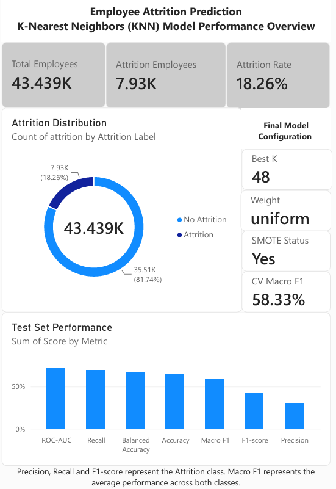
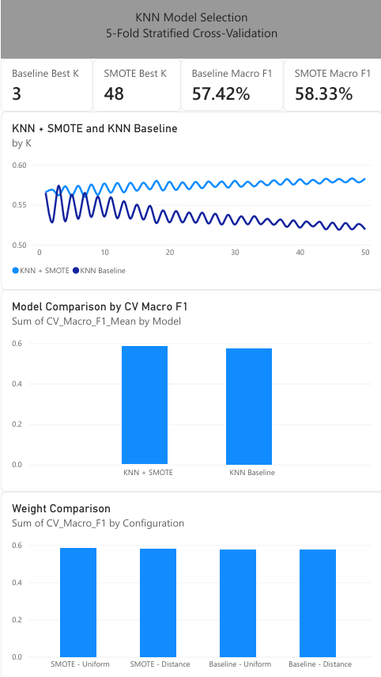
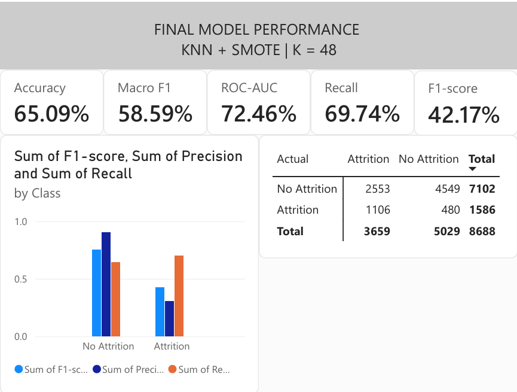

# Employee Attrition Prediction

A group machine learning project that analyzes employee-related factors and develops classification models to predict employee attrition.

> **Project Status:** In Progress
> **Project Type:** Group Machine Learning Project

## Project Overview

This project analyzes employee-related data to explore factors associated with employee attrition and develop machine learning models for predicting whether an employee is likely to leave the organization.

The project includes:

* Data checking and preprocessing
* Exploratory Data Analysis (EDA)
* Data visualization
* K-Nearest Neighbors (KNN)
* Naive Bayes
* Model evaluation
* Power BI visualization

## Dataset

The project uses the **Employee Attrition in the AI & Hybrid-Work Era** dataset from Kaggle.

The original dataset is not included in this repository.

See [`data/README.md`](data/README.md) for more information about the dataset and data source.

## Project Structure

```text
Employee-Attrition-Prediction/
│
├── data/
│   └── README.md
│
├── notebooks/
│   ├── 01_data_checking.ipynb
│   ├── 02_data_visualization.ipynb
│   ├── 03_knn_model.ipynb
│   └── 04_naive_bayes_model.ipynb
│
├── results/
│   ├── knn/
│   └── naive_bayes/
│
├── visualizations/
│   └── powerbi/
│
├── README.md
└── requirements.txt
```

## Machine Learning Models

### K-Nearest Neighbors (KNN)

KNN is used to classify employees into:

* `0` = No Attrition
* `1` = Attrition

The K value and model configuration are selected using **5-Fold Stratified Cross-Validation** with Macro F1 as the main evaluation metric.

The final KNN configuration is:

* **K:** 48
* **Weight:** uniform
* **SMOTE:** Used
* **CV Macro F1:** 0.5833 ± 0.0045

On the test set, the final KNN model achieved:

* **Accuracy:** 65.09%
* **Macro F1:** 58.59%
* **Balanced Accuracy:** 66.89%
* **ROC-AUC:** 72.46%

### Naive Bayes

Naive Bayes is being developed as another classification model for predicting employee attrition. Its results will be used for comparison with the KNN model.

## Evaluation

The models are evaluated using:

* Accuracy
* Precision
* Recall
* F1-score
* Macro F1
* Balanced Accuracy
* ROC-AUC
* Confusion Matrix

For the KNN model, **Macro F1** is used as the main metric during cross-validation because the target classes are imbalanced.

## Visualization

Power BI is used to visualize the analysis and model results.

The current Power BI dashboard focuses on the KNN analysis and includes:

* Employee Attrition Overview
* KNN Model Selection
* Final Model Performance
* Confusion Matrix
* Performance by Class

## Power BI Visualization

The Power BI dashboard presents the KNN analysis across three main sections.

### 1. Employee Attrition Overview

Presents the dataset overview, attrition distribution, and selected KNN model configuration.



### 2. KNN Model Selection

Presents the comparison between the baseline KNN and KNN with SMOTE using 5-Fold Stratified Cross-Validation, including K selection and weight comparison.



### 3. Final Model Performance

Presents the final KNN model's test-set metrics, performance by class, and confusion matrix.




> **Note:** The overall project is still in progress as different parts of the group project are being developed.

## My Contribution

My main responsibility in this project is the **K-Nearest Neighbors (KNN)** component.

My contributions include:

* Preparing and preprocessing data required for KNN classification
* Selecting the K value using 5-Fold Stratified Cross-Validation
* Comparing KNN configurations with and without SMOTE
* Comparing uniform and distance weighting
* Training and evaluating the final KNN model
* Analyzing model performance using classification metrics
* Creating Power BI visualizations for the KNN analysis

## Tools and Technologies

* Python
* Pandas
* NumPy
* Scikit-learn
* imbalanced-learn
* Matplotlib
* Seaborn
* Jupyter Notebook
* Power BI

## Team

This project was developed as a group machine learning project, with different members responsible for different components including data preprocessing, exploratory data analysis, KNN, Naive Bayes, and visualization.
